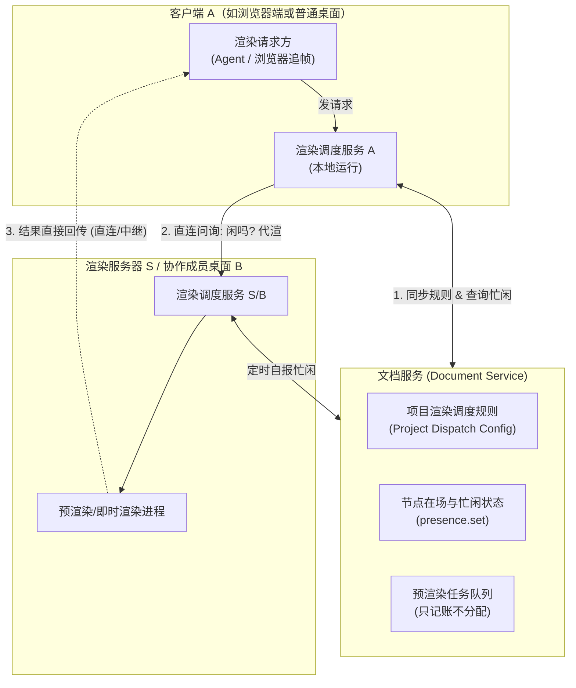
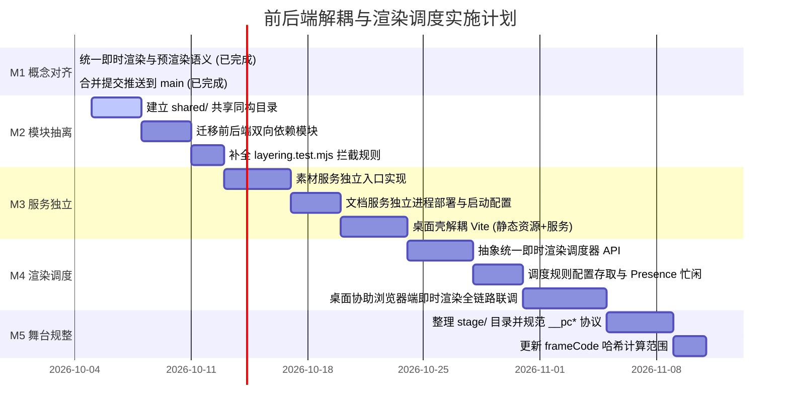

# 前后端解耦与渲染调度演进计划

> 本计划总结自 2026-10-04 架构 review 与需求讨论。主要覆盖：前后端架构解耦、代码目录职责重组、统一渲染术语体系，以及基于项目级配置的分布式渲染调度方案。

---

## 1. 背景与核心动机

在 PromptCut 现有架构演进过程中，代码组织与渲染机制呈现以下特征与改进空间：

1. **前后端解耦程度**：
   - **通信协议已解耦**：前端单页应用与服务端通过标准 HTTP `/api/**` 与 WebSocket `/docservice` 交互，未越过网络直接调用底层。
   - **运行时与部署未分离**：本地和桌面正式版中，Node 后端以 27 个 `vite-plugin-*` 中间件形式挂载在 Vite 开发服务器内；桌面外壳直接启动 `vite.js` 作为 sidecar。由此带来了静态中间件文件穿透风险（需依赖 `fsDeny` 阻断 cookie 与日志泄漏）及文件监视（watcher）异常导致服务崩溃的隐患。
   - **模块引用存在双向交织**：前后端缺少公用的共享目录，导致服务端直接引用前端纯计算代码（约 26 处），前端在线模式亦直接引用服务端同构模块（9 个文件）。
2. **渲染概念与调度演进**：
   - 之前“查询渲染”、“预渲染”、“活渲”在文档与代码中存在职责重叠；
   - 现已确立**即时渲染**（Instant Rendering）与**预渲染**（Prerender）二元体系；
   - 需要一套项目级的渲染调度规则，由各端调度器驱动，实现从“单机死板排队”演进至“多端灵活互助与分流”。

---

## 2. 核心概念与权责界定

```
                  ┌──────────────────────────────────────────────┐
                  │                 渲染请求分类                  │
                  └──────┬────────────────────────────────┬──────┘
                         │                                │
            ┌────────────▼───────────┐       ┌────────────▼───────────┐
            │        即时渲染         │       │         预渲染          │
            │  (Instant Rendering)   │       │      (Prerender)       │
            └────────────┬───────────┘       └────────────┬───────────┘
                         │                                │
        • 有人正等着看结果(Agent / 浏览器)      • 没人等着看，离屏提前渲染
        • 目标：指定时刻画面(单帧/预览片段)     • 目标：重卡快照 / 轨道流
        • 数据流：直传回请求方，不经素材服务     • 数据流：推送到素材服务存取
        • 调度模型：推(Push)，调度器定向派发    • 调度模型：拉(Pull)，队列认领
```

### 2.1 即时渲染（Instant Rendering）
- **定义**：有人正等着看结果时的按需当场渲染。结果直接从渲染位置回传给请求方，**不进预渲染队列，不经过素材服务**。取代旧称“查询渲染”。
- **典型场景**：
  1. **Agent 观察**：Agent 调用 `see_frames`、`bake_card` 即时观察当前时间轴画面；
  2. **弱设备即时辅助**：在线浏览器模式下无法运行某些复杂卡片（如用户卡、图卡）且当前帧尚无预渲染产物时，停下追帧触发即时渲染，由桌面节点协助渲染；
  3. **交互即时插队**：AI 栏操作预览（改动前后对比动图）、3D 视图用户当前等待的贴图。

### 2.2 预渲染（Prerender）
- **定义**：没人等着看的时候离屏预先渲染重卡。产出 HTML 快照或视频轨道流，**推送到素材服务**，供播放、拖动、导出时直接贴上。
- **执行方式**：任务发布到文档服务的任务队列，由各渲染节点（本地 PC、独立渲染主机、纯浏览器）在闲时按自身能力认领。

### 2.3 活渲（Live Rendering）
- 卡片在各自的渲染舞台（Stage）内当场逐帧计算并绘制，永远在自己的本地/浏览器舞台主线程内执行，不派发给外部。

---

## 3. 架构演进与目录划分

### 3.1 目标目录布局

摒弃简单的“前端/后端”二分法，将同时涉及浏览器渲染逻辑与计算模型的代码按权责分为四层：

```
PromptCut/
├── frontend/                     # 前端工程
│   ├── editor/                   # 编辑界面：UI、Store、Skins、交互组件、页面侧 Agent 面板
│   └── stage/                    # 浏览器渲染舞台：StageView、Render 管线、Cards、Parts
│       ├── cards/user/           # 用户卡源码目录（保持外部协议路径不变）
│       └── protocol/             # 舞台控制协议（统一 __pc* 钩子与双向通信规范）
│
├── shared/                       # 前后端共享纯模块（零 Node 内置依赖，前后端同构）
│   ├── kernel/                   # 项目数据模型、时钟定义、核心 Schema
│   ├── calc/                     # 确定性纯计算（frameSize、layerInputSig、shardPlan、滤镜链等）
│   └── protocol/                 # 跨端通信与消息契约（Auth 客户端、render-node、mcp-tools、队列消息格式）
│
└── backend/                      # 服务端体系（原 server/）
    ├── docservice/               # 文档服务：协同、版本日志、任务记账
    ├── asset/                    # 素材服务：分片读写、BlobStore、HTTP 路由
    ├── render/                   # 渲染控制与调度
    │   ├── dispatch/             # 本地渲染调度服务（执行项目调度规则）
    │   ├── bakery/               # Puppeteer 驱动、确定性虚拟时钟与截图控制
    │   └── prerender/            # 预渲染进程生命周期与 worker 管理
    └── services/                 # Agent 宿主环境、感知类工具（STT、视觉拼图、镜头识别）
```

### 3.2 守门依赖规则（Layering Rules）

通过静态依赖检查（集成于 `src/layering.test.mjs`）严格卡口：
1. **下层不引用上层**：`shared` 严禁引用 `frontend` 或 `backend`；
2. **前后端源码物理隔离**：`frontend/editor` 与 `backend` 之间严禁任何直接的相对源码 import，必须通过 `shared` 或 HTTP/WebSocket 协议边界交互；
3. **舞台纯粹性**：`frontend/stage` 仅允许引用 `shared`，不可引用 `frontend/editor`；
4. **编译与代码版本**：`server/frame-code.mjs` 的哈希范围收窄为 `frontend/stage/` + `shared/` + 截图核心模块，改动编辑器 UI 不再导致预渲染缓存大面积失效。

---

## 4. 分布式渲染调度系统设计

### 4.1 架构与数据流

遵循**“规则集中记账，调度边缘自决”**原则，保证文档服务不成为性能单点：



### 4.2 调度规则 Schema 草案（存储于文档服务）

```jsonc
{
  "version": 1,
  // 1. 即时渲染规则：主动探测与定向派发（Push 模式）
  "instant": {
    "mode": "server-first",          // 调度模式："local" | "pinned" | "server-first" | "shared"
    "targets": ["render-host-01"],   // 指定优先服务器或主机标识列表
    "askTimeoutMs": 1500,            // 忙闲问询超时，超时视为不可用/满载
    "fallback": [                    // 兜底梯次
      "local",                       // 尝试本机做
      "prerendered",                 // 读取素材服务中已有预渲染快照
      "notice"                       // 提示「需要本地 PC 渲染辅助」
    ]
  },
  // 2. 预渲染规则：基于任务队列的自主认领（Pull 模式）
  "prerender": {
    "mode": "shared",                // 缺省为 "shared"（大家一起认领）
    "targets": ["render-host-01"],   // 指定优先节点
    "othersClaimAfterMs": 10000      // 挂出超时后放开给其它成员认领
  },
  // 3. 协作权限策略
  "collaboration": {
    "allowMemberAssist": true        // 本项目是否允许成员电脑互助即时渲染
  }
}
```

### 4.3 调度模式详解

| 模式 | 即时渲染（Instant）行为 | 预渲染（Prerender）行为 |
|---|---|---|
| **指定机器 (`pinned`)** | 请求直接发送至指定目标机器；若不可达则按 fallback 降级。 | 任务标注 `preferNode`，仅指定机器认领。 |
| **服务器优先 (`server-first`)** | 调度器先问询渲染服务器是否空闲；空闲则派送代渲，满载/超时转回本机。 | 任务发布后前 $N$ 秒只允许该服务器认领，超时未接则全员放开。 |
| **大家一起做 (`shared`)** | 调度器在已授权且空闲的桌面成员中选一台代渲（优先就近或持有素材的节点）。 | 任意节点闲时自主从文档服务队列拉取任务（现状）。 |

### 4.4 桌面端协助浏览器端即时渲染流程
1. 在线浏览器模式下遇到无法活渲的用户卡/图卡，且素材服务中尚无产物；
2. 浏览器内部调度器读取项目规则，发现 `allowMemberAssist === true`；
3. 向文档服务 Presence 广播/检索当前在线的桌面成员；
4. 调度器向空闲的桌面端发起即时渲染 RPC（带上卡片参数与当前时间 $t$）；
5. 桌面端预渲染进程利用内置 Chrome 渲染单帧并直接回传位图（或通过云端托管中继传输）；
6. 浏览器端即时呈现画面，消除“长时间等待离线预渲染任务”的卡顿感。

### 4.5 授权与安全控制（双重同意机制）
- **项目级同意**：由项目创建者在调度规则中声明是否开启跨成员互助；
- **设备级同意**：成员桌面应用在本地配置中提供物理开关（“允许协助项目成员进行即时渲染”）。只有双方均开启，调度器才可指派。
- **纯浏览器防线**：纯浏览器节点严格保持“绝不替他人干活”的红线不变，仅作为受益方。

---

## 5. 实施路线图（Milestones）



### 详细步骤与交付物：

1. **M1：概念统一（已闭环）**
   - 交付物：已将即时渲染（取代查询渲染）与预渲染严格区分并写入 `docs/semantics/` 7 份主干文档，已合入 `main`。
2. **M2：共享模块抽取（无缓存失效风险）**
   - 动作：新建 `shared/` 目录，将 `server/auth` 客户端、`render-node` 会话、`mcp-tools` 规范、消息类型提取到 `shared/`。
   - 验证：在 `src/layering.test.mjs` 中加入双向隔离卡口。
3. **M3：后端服务独立（消除 Vite 宿主依赖）**
   - 动作：提供脱离 Vite 的独立 Node HTTP 服务启动入口；桌面正式版从“跑 Vite dev server”升级为“托管构建静态页面 + 独立 Node 服务”。
   - 价值：消除 `fsDeny` 安全死角，提升守护进程稳定性。
4. **M4：渲染调度服务与即时渲染派发**
   - 动作：实现基于项目规则的 `RenderDispatcher`，统一承接 Agent 与弱设备的即时渲染请求；打通“桌面端协助浏览器端即时渲染”。
5. **M5：舞台目录重构与代码指纹优化**
   - 动作：规整 `stage/` 目录；`server/frame-code.mjs` 仅对舞台与共享核心计算文件做哈希。
   - 注意：该阶段会引起预渲染缓存键迭代，需与团队统筹执行。
